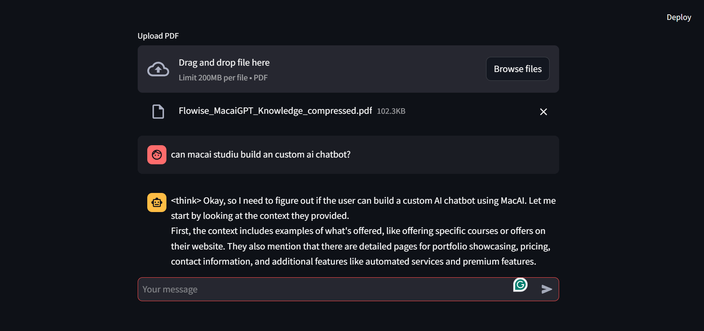

# Local RAG Chatbot with Ollama DeepSeek

A local RAG (Retrieval-Augmented Generation) chatbot implementation using Ollama's DeepSeek model, Streamlit, and LangChain. This application allows users to upload PDF documents and ask questions about their content, with answers generated using the local DeepSeek model.

## Features

- 🚀 Fully local implementation - no cloud services required
- 📑 PDF document upload and processing
- 💬 Interactive chat interface
- 🔍 RAG (Retrieval-Augmented Generation) implementation
- 🤖 Powered by DeepSeek model through Ollama
- 🔗 Built with LangChain and Streamlit

## Prerequisites

- Python 3.8+
- [Ollama](https://ollama.ai/) installed locally
- DeepSeek model pulled in Ollama
2. Open your web browser and navigate to the provided local URL (typically http://localhost:8501)
3. Upload a PDF document using the file uploader
4. Ask questions about the document content in the chat interface

## How it Works

1. **Document Processing**:
   - PDF documents are loaded using PDFPlumberLoader
   - Documents are split into chunks using RecursiveCharacterTextSplitter
   - Text chunks are embedded using DeepSeek embeddings

2. **RAG Implementation**:
   - Uses InMemoryVectorStore for document storage
   - Implements similarity search for relevant context retrieval
   - Combines retrieved context with user questions for accurate answers

3. **Model Integration**:
   - Utilizes the DeepSeek model through Ollama
   - Processes queries locally without external API calls
   - Generates contextual responses based on document content

## Installation
1. Clone the repository
2. Create and activate a virtual environment
3. Install the required packages
4. Pull the DeepSeek model using Ollama

## Dependencies
- streamlit
- langchain_core
- langchain_community
- langchain_ollama
- pdfplumber

## Contributing
Contributions are welcome! Please feel free to submit a Pull Request.

## License
This project is licensed under the MIT License - see the LICENSE file for details.

## Acknowledgment
- [Ollama](https://ollama.ai/) for providing local model deployment
- [DeepSeek](https://github.com/deepseek-ai/DeepSeek-LLM) for the language model
- [LangChain](https://github.com/langchain-ai/langchain) for the RAG implementation framework
- [Streamlit](https://streamlit.io/) for the web interface

## Support
If you encounter any issues or have questions, please open an issue in the GitHub repository.
